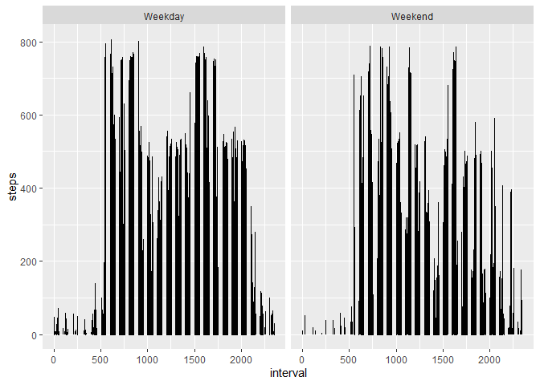

## Note to grader

I have attempted to reproduce the html from the R Markdown by editing this file. Github does not display the html R Markdown output.

## Introduction

It is now possible to collect a large amount of data about personal
movement using activity monitoring devices such as a
[Fitbit](http://www.fitbit.com), [Nike
Fuelband](http://www.nike.com/us/en_us/c/nikeplus-fuelband), or
[Jawbone Up](https://jawbone.com/up). These type of devices are part of
the "quantified self" movement -- a group of enthusiasts who take
measurements about themselves regularly to improve their health, to
find patterns in their behavior, or because they are tech geeks. But
these data remain under-utilized both because the raw data are hard to
obtain and there is a lack of statistical methods and software for
processing and interpreting the data.

This assignment makes use of data from a personal activity monitoring
device. This device collects data at 5 minute intervals through out the
day. The data consists of two months of data from an anonymous
individual collected during the months of October and November, 2012
and include the number of steps taken in 5 minute intervals each day.

## Data

The data for this assignment can be downloaded from the course web
site:

* Dataset: [Activity monitoring data](https://d396qusza40orc.cloudfront.net/repdata%2Fdata%2Factivity.zip) [52K]

The variables included in this dataset are:

* **steps**: Number of steps taking in a 5-minute interval (missing
    values are coded as `NA`)

* **date**: The date on which the measurement was taken in YYYY-MM-DD
    format

* **interval**: Identifier for the 5-minute interval in which
    measurement was taken

The dataset is stored in a comma-separated-value (CSV) file and there
are a total of 17,568 observations in this
dataset.


## Assignment

This assignment will be described in multiple parts. You will need to
write a report that answers the questions detailed below. Ultimately,
you will need to complete the entire assignment in a **single R
markdown** document that can be processed by **knitr** and be
transformed into an HTML file.

Throughout your report make sure you always include the code that you
used to generate the output you present. When writing code chunks in
the R markdown document, always use `echo = TRUE` so that someone else
will be able to read the code. **This assignment will be evaluated via
peer assessment so it is essential that your peer evaluators be able
to review the code for your analysis**.

For the plotting aspects of this assignment, feel free to use any
plotting system in R (i.e., base, lattice, ggplot2)

Fork/clone the [GitHub repository created for this
assignment](http://github.com/rdpeng/RepData_PeerAssessment1). You
will submit this assignment by pushing your completed files into your
forked repository on GitHub. The assignment submission will consist of
the URL to your GitHub repository and the SHA-1 commit ID for your
repository state.

NOTE: The GitHub repository also contains the dataset for the
assignment so you do not have to download the data separately.

### Loading and preprocessing the data

Show any code that is needed to

1. Load the data (i.e. `read.csv()`)

I load the data into a variable named proj_data, and check the percent of NAs in the steps variable.

proj_data <- read_csv("./data/activity.csv")

2. Process/transform the data (if necessary) into a format suitable for your analysis

### What is mean total number of steps taken per day?

For this part of the assignment, you can ignore the missing values in
the dataset.

1. Make a histogram of the total number of steps taken each day


2. Calculate and report the **mean** and **median** total number of steps taken per day

Mean:


Median:


### What is the average daily activity pattern?

1. Make a time series plot (i.e. `type = "l"`) of the 5-minute interval (x-axis) and the average number of steps taken, averaged across all days (y-axis)


2. Which 5-minute interval, on average across all the days in the dataset, contains the maximum number of steps?

-----The 5-minute interval that, on average, contains the maximum number of steps is found at 8 minutes and 35 seconds from the beginning of the day. The mean steps for this maximum interval is 206.

-----I will answer the last two questions together. Actually, I want to answer them in the opposite order: I want to know the variations by day of the week and by separating the weekdays from the weekends, and then I want to carry out my imputation.

Intervals by day of the week.


Intervals by if the day is a weekday or a weekend.



There is variation for every day of the week, and when we compare weekdays to weekends, there is a lot of activity on weekday mornings that is not found during the weekends.

### Imputing missing values

Note that there are a number of days/intervals where there are missing
values (coded as `NA`). The presence of missing days may introduce
bias into some calculations or summaries of the data.

1. Calculate and report the total number of missing values in the dataset (i.e. the total number of rows with `NA`s)

2. Devise a strategy for filling in all of the missing values in the dataset. The strategy does not need to be sophisticated. For example, you could use the mean/median for that day, or the mean for that 5-minute interval, etc.

3. Create a new dataset that is equal to the original dataset but with the missing data filled in.

4. Make a histogram of the total number of steps taken each day and Calculate and report the **mean** and **median** total number of steps taken per day. Do these values differ from the estimates from the first part of the assignment? What is the impact of imputing missing data on the estimates of the total daily number of steps?

### Are there differences in activity patterns between weekdays and weekends?

For this part the `weekdays()` function may be of some help here. Use
the dataset with the filled-in missing values for this part.

1. Create a new factor variable in the dataset with two levels -- "weekday" and "weekend" indicating whether a given date is a weekday or weekend day.

1. Make a panel plot containing a time series plot (i.e. `type = "l"`) of the 5-minute interval (x-axis) and the average number of steps taken, averaged across all weekday days or weekend days (y-axis). 

## My imputation steps.

In order to impute NAs, I follow this procedure:

1. I separate proj_data_factors, which is the data I have been plotting, which includes NAs into two datasets: one with NAs, one without. 

2. I then split the data that has no NA values into weekday data and weekend data.

3. I calculate the mean steps for each time interval for the "no NA values" data separately for  weekday data and weekend data.

Here is the imputation distribution for weekdays. Weekdays have lots of steps in the early morning that weekends do not have.


Here is the imputation distribution for weekends.


4. I use these distributions as the data I will impute. I assign the mean steps by interval from the "no NA values" weekday data to the weekday data with NA values for steps. I do the same for the weekend data by imputing weeking missing values with weekend modeled values from the mean steps in the "no NA values" weekend data.

5. I perform checks on the source data for the imputation to make sure the imputation makes sense. 


I check in the final dataset the intervals by day of the week for the imputed data.


I check in the final dataset the intervals by if the day is a weekday or a weekend for the imputed data.


Finally, I draw the day by day plot and see that NA weekdays have been imputed and that NA weekends have been imputed. The means for the imputations are lower than the typical day because there are days with complete data (no NAs) with very small step counts, such as Oct 2, and Nov 15. In a more sophisticated imputation, I would have excluded those two days from my reference distribution to use as the data to assign to the NA days.


## Submitting the Assignment

To submit the assignment:

1. Commit your completed `PA1_template.Rmd` file to the `master` branch of your git repository (you should already be on the `master` branch unless you created new ones)

2. Commit your `PA1_template.md` and `PA1_template.html` files produced by processing your R markdown file with the `knit2html()` function in R (from the **knitr** package)

3. If your document has figures included (it should) then they should have been placed in the `figure/` directory by default (unless you overrode the default). Add and commit the `figure/` directory to your git repository.

4. Push your `master` branch to GitHub.

5. Submit the URL to your GitHub repository for this assignment on the course web site.

In addition to submitting the URL for your GitHub repository, you will
need to submit the 40 character SHA-1 hash (as string of numbers from
0-9 and letters from a-f) that identifies the repository commit that
contains the version of the files you want to submit. You can do this
in GitHub by doing the following:

1. Go into your GitHub repository web page for this assignment

2. Click on the "?? commits" link where ?? is the number of commits you have in the repository. For example, if you made a total of 10 commits to this repository, the link should say "10 commits".

3. You will see a list of commits that you have made to this repository. The most recent commit is at the very top. If this represents the version of the files you want to submit, then just click the "copy to clipboard" button on the right hand side that should appear when you hover over the SHA-1 hash. Paste this SHA-1 hash into the course web site when you submit your assignment. If you don't want to use the most recent commit, then go down and find the commit you want and copy the SHA-1 hash.

A valid submission will look something like (this is just an **example**!)

```r
https://github.com/rdpeng/RepData_PeerAssessment1

7c376cc5447f11537f8740af8e07d6facc3d9645
```
